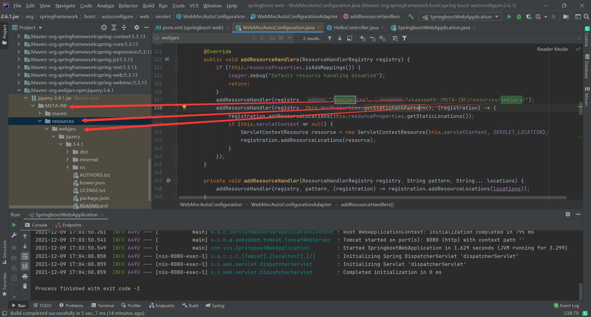

# SpringBoot-WEB

> **相关笔记**：[[SpringBoot]] · [[Spring]] · [[SpringMVC]]


### 要解决的问题

- #### 导入静态资源

- #### 首页定制

- #### jsp ？，模板引擎 thymeleaf

- #### 装配和扩展SpringMVC

- #### CRUD

- #### 拦截器

- #### 中英文切换


### 一、静态资源问题

#### 1、webjars（不经常使用）



#### 利用依赖导入Jquery

```xml
<!--利用webjars导入jquery-->
<dependency>
	<groupId>org.webjars.npm</groupId>
	<artifactId>jquery</artifactId>
	<version>3.6.0</version>
</dependency>
```

#### 2、放在以下几个目录

- classpath:/resources/
- classpath:/static/
- classpath:/public/
- /****

#### 优先级：resources>static>public


### 二、首页定制

```java
WelcomePageHandlerMapping--------->getWelcomePage()----------->getIndexHtml(location)------------>Resource resource = location.createRelative("index.html");
```

#### #在Templates目录下的所有页面只能通过controller来跳转


### 三、模板引擎---Thymeleaf

- Spring官方支持的服务的渲染模板中，并不包含jsp。而是Thymeleaf和Freemarker等，而Thymeleaf与SpringMVC的视图技术，及SpringBoot的自动化配置集成非常完美，几乎没有任何成本，你只用关注Thymeleaf的语法即可。

导入依赖：

```xml
<!--Thymeleaf-->
        <dependency>
            <groupId>org.springframework.boot</groupId>
            <artifactId>spring-boot-starter-thymeleaf</artifactId>
        </dependency>
```


```java
public class ThymeleafProperties {

	private static final Charset DEFAULT_ENCODING = StandardCharsets.UTF_8;

	public static final String DEFAULT_PREFIX = "classpath:/templates/";   //前缀
  
	public static final String DEFAULT_SUFFIX = ".html";               //后缀
```

导入HTML依赖：

```html
<html lang="en" xmlns:th="http://www.thymeleaf.org">
```

所有的Html元素都可以被其接管，使用方法：th：元素名

### 四、SpringMVC装配和拓展

如果用户对SpringMVC进行了配置则采用用户的配置，否则使用默认配置

#### 拓展springmvc方法：

- 在config包下写相关的配置
- 利用@Configuration进行注解
- 新建的类需要继承WebMvcConfigurer接口
- 利用重写来进行相关配置的修改

```java
//扩展SpringMVC
@Configuration
public class MyMvcConfig implements WebMvcConfigurer {

    /*视图跳转*/
    @Override
    public void addViewControllers(ViewControllerRegistry registry) {
        registry.addViewController("/bobo").setViewName("index");
    }
}

```

### @EnableWebMvc

- 该注解导入了DelegatingWebMvcConfiguration.class类

- DelegatingWebMvcConfiguration.class类：从容器中获取所有的webmvcconfig

- ```java
  public class DelegatingWebMvcConfiguration extends WebMvcConfigurationSupport
  ```

- 而MVC自动配置WebMvcAutoConfiguration中存在一个条件

- ```java
  @ConditionalOnMissingBean(WebMvcConfigurationSupport.class)
  ```

- 只有WebMvcConfigurationSupport不存在时，自动配置才生效，使用@EnableWebMvc使系统中存在了WebMvcConfigurationSupport类，因此会导致整个自动配置类失效，变成全部接管。


### 整合Mybatis  

依赖

```xml
<!--Mybatis-->
        <dependency>
            <groupId>org.mybatis.spring.boot</groupId>
            <artifactId>mybatis-spring-boot-starter</artifactId>
            <version>2.2.0</version>
        </dependency>
```

配置spring.datasource的数据库连接配置

```yam
spring: 
  datasource:
    username: root
    password: 123456
    url: jdbc:mysql://localhost:3306/db_bookstore?useUnicode=true&characterEncoding=UTF-8&serverTimezone=Asia/Shanghai
    driver-class-name: com.mysql.cj.jdbc.Driver
    type: com.alibaba.druid.pool.DruidDataSource
```

识别Mapper的方法：

- 利用注解@Mapper
- 在启动类上添加注解@MapperScan("com.yzu.mapper")

设置别名和mapper映射，在ssm中是写在xml配置文件中，在springboot中只要在yaml中配置即可

```yaml
mybatis:
  type-aliases-package: com.yzu.pojo
  mapper-locations: classpath:mybatis/mapper/*.xml
  
```


