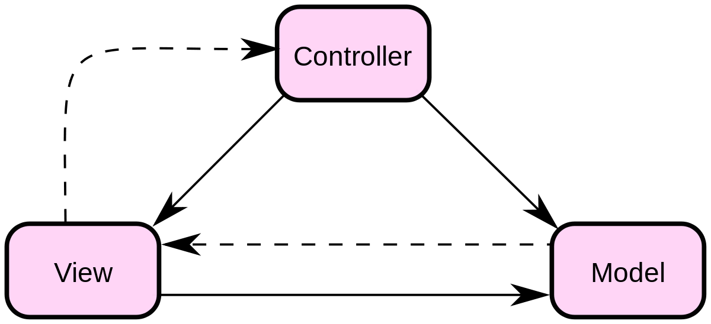

# SpringMVC

> **相关笔记**：[[Spring]] · [[SpringBoot]] · [[SpringClould]] · [[SpringBoot-Web]]


### MVC：

MVC 模式代表 Model-View-Controller（模型-视图-控制器） 模式。这种模式用于应用程序的分层开发。

- **Model（模型）** - 模型代表一个存取数据的对象或 JAVA POJO。它也可以带有逻辑，在数据变化时更新控制器。
- **View（视图）** - 视图代表模型包含的数据的可视化。
- **Controller（控制器）** - 控制器作用于模型和视图上。它控制数据流向模型对象，并在数据变化时更新视图。它使视图与模型分离开。



为什么学习SpringMVC：

- 轻量级，简单易学
- 高效，基于请求响应的MVC框架
- 与Spring兼容性好，无缝结合
- 约定优于配置
- 功能强大：RESTful、数据验证、格式化、本地化、主题等
- 简洁灵活
- 使用的公司很多


### Spring的web框架围绕DispatcherServlet设计。

### DispatcherServlet的作用是将请求分发到不同的处理器。

### Spring MVC框架像许多其他MVC框架一样, **以请求为驱动** , **围绕一个中心Servlet分派请求及提供其他功能**


### DispatcherServlet的本质还是Servlet


### 实线为SpringMVC完成的

### 操作：

#### 	1、用户发送请求，由DispatcherServlet前置控制器（分发、调度）进行接收请求并拦截请求

#### 	2、由DispatcherServlet调用HandlerMapping（处理映射），根据用户的请求查找Handler，

```xml
 <!--Handler-->
    <bean id="/hello" class="com.yzu.controller.HelloController"/>
```

#### 	3、其中HandlerExecution为具体的Handler

####     4、找到控制器后将解析后的信息传递给DispatcherServlet

### 	<span style='color:red'>经过1、2、3、4后根据用户请求找到了相应的处理器</span>

#### 	5、DispatcherServlet调用HandlerAdapter（处理器适配器），根据相应规则去执行Handler

#### 	6、HandlerAdapter调用controller，返回ModelAndView

#### 	7、Controller将具体的执行信息返回给HandlerAdapter,如ModelAndView。

#### 	8、HandlerAdapter将视图逻辑名或模型传递给DispatcherServlet。

### 	<span style='color:red'>经过5、6、7、8后已经获得了需要传给前端的数据，以及相应的视图</span>

#### 	9、DispatcherServlet调用视图解析器ViewResolver来解析HandlerAdapter传递的逻辑视图名。

```xml
<!--视图解析器:DispatcherServlet给他的ModelAndView
        1、获取ModelAndView的数据
        2、解析ModelAndView的视图名字
        3、拼接视图名字，找到对应的视图/WEB-INF/jsp/+视图名+.jsp
        4、将数据渲染到视图上
    -->
    <bean class="org.springframework.web.servlet.view.InternalResourceViewResolver" id="InternalResourceViewResolver">
        <!--前缀-->
        <property name="prefix" value="/WEB-INF/jsp/"/>
        <!--后缀-->
        <property name="suffix" value=".jsp"/>
    </bean>
```

#### 	10、视图解析器将解析的逻辑视图名传给DispatcherServlet。

#### 	11、DispatcherServlet根据视图解析器解析的视图结果，调用具体的视图。

#### 	12、最终视图呈现给用户。


## HelloSpring

### 1、新建一个moudle，添加web支持

### 2、在WEB-INF目录下添加文件夹用于存放视图hello.jsp

### 3、确保项目依赖存在，确保最后发布项目的Artifacts里有依赖，即lib包，若没有，则新建lib并进行添加

### 4、配置web.xml

- 配置DispatcherServlet这是SpringMVC的核心，请求分发器、前端控制器,即注册servlet

  ```xml
   <!--1、注册DispatcherServlet-->
      <servlet>
          <servlet-name>springmvc</servlet-name>
          <servlet-class>org.springframework.web.servlet.DispatcherServlet</servlet-class>
          <!--关联一个springmvc的配置文件：springmvc-servlet.xml-->
          <init-param>
              <param-name>contextConfigLocation</param-name>
              <param-value>classpath:springmvc-servlet.xml</param-value>
          </init-param>
          <!--启动级别1，服务器一启动，它就启动-->
          <load-on-startup>1</load-on-startup>
      </servlet>
   <!--/匹配所有请求:不包括.jsp
       /*匹配所有请求:包括.jsp
  
  	在此处如果使用/*,当请求一个jsp文件时比如http://localhost:8080/hello.jsp时也会被拦截会造成错误
      -->
      <servlet-mapping>
          <servlet-name>springmvc</servlet-name>
          <url-pattern>/</url-pattern>
          
      </servlet-mapping>
  <filter>
          <filter-name>encoding</filter-name>
          <filter-class>org.springframework.web.filter.CharacterEncodingFilter</filter-class>
          <init-param>
              <param-name>encoding</param-name>
              <param-value>utf-8</param-value>
          </init-param>
      </filter>
      <filter-mapping>
          <filter-name>encoding</filter-name>
          <url-pattern>/*</url-pattern>
      </filter-mapping>
  ```

### 5、配置springmvc-servlet.xml，springmvc的配置文件

- 处理器映射器

```xml
<!--处理器映射器-->
    <bean class="org.springframework.web.servlet.handler.BeanNameUrlHandlerMapping"/>
```

- 处理器适配器

```xml
 <!--处理器适配器-->
    <bean class="org.springframework.web.servlet.mvc.SimpleControllerHandlerAdapter"/>
```

- 视图解析器

```xml
<!--视图解析器:DispatcherServlet给他的ModelAndView
        1、获取ModelAndView的数据
        2、解析ModelAndView的视图名字
        3、拼接视图名字，找到对应的视图/WEB-INF/jsp/+视图名+.jsp
        4、将数据渲染到视图上
    -->
    <bean class="org.springframework.web.servlet.view.InternalResourceViewResolver" id="InternalResourceViewResolver">
        <!--前缀-->
        <property name="prefix" value="/WEB-INF/jsp/"/>
        <!--后缀-->
        <property name="suffix" value=".jsp"/>
    </bean>
```

### 6、编写Controller

- 有Controller注解或实现Controller接口的方法，需要实现handleRequest方法返回一个ModelAndView
- 模板如下

```xml
package com.yzu.controller;
import org.springframework.web.servlet.ModelAndView;
import org.springframework.web.servlet.mvc.Controller;
import javax.servlet.http.HttpServletRequest;
import javax.servlet.http.HttpServletResponse;

public class HelloController implements Controller {

    @Override
    public ModelAndView handleRequest(HttpServletRequest httpServletRequest, HttpServletResponse httpServletResponse) throws Exception {
        //ModelAndView 模型和视图
        ModelAndView mv = new ModelAndView();
		//业务代码
		//封装对象，放在ModelAndView中Model
        mv.addObject("msg","HelloSpringMVC!");
		...
		...
		//视图跳转
 		//封装要跳转的视图，放在ModelAndView中
        mv.setViewName("hello"); //: /WEB-INF/jsp/hello.jsp
		...
        return mv;    }
}

```

### 7、使用了BeanNameUrlHandlerMapping处理器

- 需要根据bean的名字来找，所以需要增加bean【使用注解则不需要】

```xml
 <!--Handler-->
    <bean id="/hello" class="com.yzu.controller.HelloController"/>
```


### Controller：

```java
//通过接口定义或注解实现两种方式
//控制器负责解析用户的请求，并将其转化为一个模型

```

### 使用接口实现：

```java
public class ControllerTest1 implements Controller {
    @Override
    public ModelAndView handleRequest(HttpServletRequest httpServletRequest, HttpServletResponse httpServletResponse) throws Exception {
        ModelAndView mv = new ModelAndView();
        mv.addObject("msg","接口实现Controller");
        mv.setViewName("Hello_01");
        return mv;
    }
}
```

### 缺点:

### 一个控制器中只有一个方法，如果需要多个方法，则要定义多个Conroller

### 需要配置bean

```xml
    <bean name="/hello" class="com.yzu.controller.ControllerTest1"/>
```


### 使用注解@Controller

需要在配置文件中配置扫描指定的包

```xml
 <!--自动扫描包，让指定包下的注解生效，有IOC容器管理-->
    <context:component-scan base-package="com.yzu.controller"/>
```

### @RequestMapping

用于映射url到控制器类或一个特定的处理程序方式


### Restful风格

就是一个资源定位及资源操作的风格为，既不是标准也不是协议，只是一种风格

**传统方式操作资源**  ：通过不同的参数来实现不同的效果！方法单一，post 和 get

​	http://127.0.0.1/item/queryItem.action?id=1 查询,GET

​	http://127.0.0.1/item/saveItem.action 新增,POST

​	http://127.0.0.1/item/updateItem.action 更新,POST

​	http://127.0.0.1/item/deleteItem.action?id=1 删除,GET或POST

**使用RESTful操作资源** ：可以通过不同的请求方式来实现不同的效果！如下：请求地址一样，但是功能可以不同！

​	http://127.0.0.1/item/1 查询,GET

​	http://127.0.0.1/item 新增,POST

​	http://127.0.0.1/item 更新,PUT

​	http://127.0.0.1/item/1 删除,DELETE

### 转发与重定向

**转发**发生在服务器端，将请求发送给服务器上的其他资源，以共同完成一次请求的处理

- 转发是服务器行为
- 转发是服务器只做了一次访问请求
- 转发浏览器地址不变
- 转发两次跳转之间传输的信息不会丢失，所以可以通过request进行数据的传递
- 转发只能将请求发送给同一个Web应用中的组件

**重定向**作用在客户端，客户端将请求发送给服务端后，**服务端响应给客户端一个新的请求地址，客户端重新发送新请求**

- 重定向是客户端行为
- 重定向是浏览器至少做了两次两次访问请求
- 重定向浏览器地址栏改变
- 重定向两次跳转之间传输的信息会丢失（request范围）
- 重定向可以指定任何的资源，包括当前应用程序中的其他资源，同一个站点上的其他应用程序中的资源，其他站点的资源


### 有视图解析器SpringMVC默认是转发

### 如果需要重定向可以改为return "redirect:/index.jsp";


## 数据处理

#### 处理前端提交的数据

提交数据 : http://localhost:8080/hello?name=bobo

处理方法 :

```
@RequestMapping("/hello")
public String hello(String name){
   System.out.println(name);
   return "hello";
}
```

后台输出 : bobo

提交数据 : http://localhost:8080/hello?username=bobo

处理方法 :

```
//@RequestParam("username") : username提交的域的名称 .
@RequestMapping("/hello")
public String hello(@RequestParam("username") String name){
   System.out.println(name);
   return "hello";
}
```

后台输出 : bobo

要求提交的表单域和对象的属性名一致  , 参数使用对象即可

1、实体类

```
public class User {
   private int id;
   private String name;
   private int age;
   //构造
   //get/set
   //tostring()
}
```

```java
 /*
    * 1、接收前端用户传递的参数，判断参数的名字，假设名字直接在方法上，可以直接使用
    * 2、假设传递的是一个对象User，匹配User对象中的字段名，如果名字一直则ok，否则，匹配不到显示为null
    * http://localhost:8080/user/t2?id=12&name=bobo&age=21
    * User{id=12, name='bobo', age=21}
    * */
    //前端接收的是一个对象:id name age
    @RequestMapping("/t2")
    public String test2(User user){
        System.out.println(user);
        return "Hello_01";
    }
```

​		

### 数据显示到前端

**第一种 : 通过ModelAndView**

```
public class ControllerTest1 implements Controller {

   public ModelAndView handleRequest(HttpServletRequest httpServletRequest,HttpServletResponse httpServletResponse) throws Exception {
       //返回一个模型视图对象
       ModelAndView mv = new ModelAndView();
       mv.addObject("msg","ControllerTest1");
       mv.setViewName("test");
       return mv;
  }
}
```


**第二种 : 通过ModelMap**

ModelMap

```
@RequestMapping("/hello")
public String hello(@RequestParam("username") String name, ModelMap model){
   //封装要显示到视图中的数据
   //相当于req.setAttribute("name",name);
   model.addAttribute("name",name);
   System.out.println(name);
   return "hello";
}
```


**第三种 : 通过Model**

Model

```
@RequestMapping("/ct2/hello")
public String hello(@RequestParam("username") String name, Model model){
   //封装要显示到视图中的数据
   //相当于req.setAttribute("name",name);
   model.addAttribute("msg",name);
   System.out.println(name);
   return "test";
}
```


## 乱码问题

```java
package com.yzu.controller;

import org.springframework.stereotype.Controller;
import org.springframework.ui.Model;
import org.springframework.web.bind.annotation.PostMapping;

@Controller
public class EncodingController {

    @PostMapping("/e/t")
    public String test(String name, Model model){
        model.addAttribute("msg",name);

        return "Hello_01";
    }
}
```

```xml
<%@ page contentType="text/html;charset=UTF-8" language="java" %>
<html>
<head>
    <title>表单</title>
</head>
<body>

<form action="/e/t" method="post">
    <input type="text" name="name">
    <input type="submit">
</form>
</body>
</html>

```

输入中文乱码后提交，显示乱码波波

**SpringMVC给我们提供了一个过滤器 , 可以在web.xml中配置 .**

```
<filter>
   <filter-name>encoding</filter-name>
   <filter-class>org.springframework.web.filter.CharacterEncodingFilter</filter-class>
   <init-param>
       <param-name>encoding</param-name>
       <param-value>utf-8</param-value>
   </init-param>
</filter>
<filter-mapping>
   <filter-name>encoding</filter-name>
   <url-pattern>/*</url-pattern>
</filter-mapping>
```

也可以自己写filter，并注册

```java
package com.yzu.filter;

import javax.servlet.*;
import javax.servlet.http.HttpServletRequest;
import javax.servlet.http.HttpServletRequestWrapper;
import javax.servlet.http.HttpServletResponse;
import java.io.IOException;
import java.io.UnsupportedEncodingException;
import java.util.Map;

public class EncodingFilter implements Filter {

    @Override
    public void destroy() {
    }

    @Override
    public void doFilter(ServletRequest request, ServletResponse response, FilterChain chain) throws IOException, ServletException {
        //处理response的字符编码
        HttpServletResponse myResponse=(HttpServletResponse) response;
        myResponse.setContentType("text/html;charset=UTF-8");

        // 转型为与协议相关对象
        HttpServletRequest httpServletRequest = (HttpServletRequest) request;
        // 对request包装增强
        HttpServletRequest myrequest = new MyRequest(httpServletRequest);
        chain.doFilter(myrequest, response);
    }

    @Override
    public void init(FilterConfig filterConfig) throws ServletException {
    }

}

//自定义request对象，HttpServletRequest的包装类
class MyRequest extends HttpServletRequestWrapper {

    private HttpServletRequest request;
    //是否编码的标记
    private boolean hasEncode;
    //定义一个可以传入HttpServletRequest对象的构造函数，以便对其进行装饰
    public MyRequest(HttpServletRequest request) {
        super(request);// super必须写
        this.request = request;
    }

    // 对需要增强方法 进行覆盖
    @Override
    public Map getParameterMap() {
        // 先获得请求方式
        String method = request.getMethod();
        if (method.equalsIgnoreCase("post")) {
            // post请求
            try {
                // 处理post乱码
                request.setCharacterEncoding("utf-8");
                return request.getParameterMap();
            } catch (UnsupportedEncodingException e) {
                e.printStackTrace();
            }
        } else if (method.equalsIgnoreCase("get")) {
            // get请求
            Map<String, String[]> parameterMap = request.getParameterMap();
            if (!hasEncode) { // 确保get手动编码逻辑只运行一次
                for (String parameterName : parameterMap.keySet()) {
                    String[] values = parameterMap.get(parameterName);
                    if (values != null) {
                        for (int i = 0; i < values.length; i++) {
                            try {
                                // 处理get乱码
                                values[i] = new String(values[i]
                                        .getBytes("ISO-8859-1"), "utf-8");
                            } catch (UnsupportedEncodingException e) {
                                e.printStackTrace();
                            }
                        }
                    }
                }
                hasEncode = true;
            }
            return parameterMap;
        }
        return super.getParameterMap();
    }

    //取一个值
    @Override
    public String getParameter(String name) {
        Map<String, String[]> parameterMap = getParameterMap();
        String[] values = parameterMap.get(name);
        if (values == null) {
            return null;
        }
        return values[0]; // 取回参数的第一个值
    }

    //取所有值
    @Override
    public String[] getParameterValues(String name) {
        Map<String, String[]> parameterMap = getParameterMap();
        String[] values = parameterMap.get(name);
        return values;
    }
}

```

```xml
<filter>
        <filter-name>encodingFilter</filter-name>
        <filter-class>com.yzu.filter.EncodingFilter</filter-class>
    </filter>

    <filter-mapping>
        <filter-name>encodingFilter</filter-name>
        <url-pattern>/*</url-pattern>
    </filter-mapping>
```

### 在WEB-INF下的所有页面无法直接访问，只能通过controller或servlet进行访问


## 过滤器与拦截器

#### 拦截器是AOP思想的具体应用


### 过滤器filter

- servlet规范中的一部分，任何java web工程均可使用
- 在url-pattern中配置了/*后，可以对所有要访问的资源进行拦截


### 拦截器

- 拦截器是SpringMVC框架自己的，只有使用了SpringMVC框架的工程才能使用
- 拦截器只会拦截**访问控制器的方法**，如果访问的是jsp/html/css/js/image是不会进行拦截的
- 自定义拦截器，实现HandlerInterceptor接口即可

